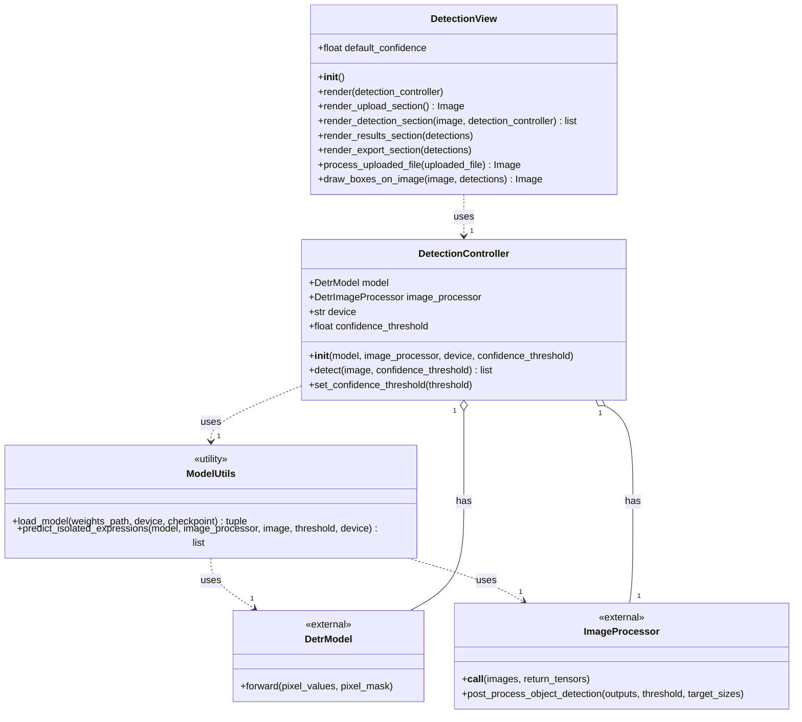

# Class Diagram for Detection Feature

```mermaid
classDiagram
    %% Classes definitions

    class DetectionView {
        +float default_confidence
        +__init__()
        +render(detection_controller)
        +render_upload_section() Image
        +render_detection_section(image, detection_controller) list
        +render_results_section(detections)
        +render_export_section(detections)
        +process_uploaded_file(uploaded_file) Image
        +draw_boxes_on_image(image, detections) Image
    }

    class DetectionController {
        +DetrModel model
        +DetrImageProcessor image_processor
        +str device
        +float confidence_threshold
        +__init__(model, image_processor, device, confidence_threshold)
        +detect(image, confidence_threshold) list
        +set_confidence_threshold(threshold)
    }

    class ModelUtils {
        <<utility>>
        +load_model(weights_path, device, checkpoint) tuple
        +predict_isolated_expressions(model, image_processor, image, threshold, device) list
    }

    class DetrModel {
        +forward(pixel_values, pixel_mask)
    }

    class ImageProcessor {
        +__call__(images, return_tensors)
        +post_process_object_detection(outputs, threshold, target_sizes)
    }

    %% Relationships
    DetectionView ..> "1" DetectionController : uses
    DetectionController ..> "1" ModelUtils : uses
    ModelUtils ..> "1" DetrModel : uses
    ModelUtils ..> "1" ImageProcessor : uses
    DetectionController "1" o-- "1" DetrModel : has
    DetectionController "1" o-- "1" ImageProcessor : has

    %% External Classes
    class DetrModel {
        <<external>>
    }
    class ImageProcessor {
        <<external>>
    }
```
